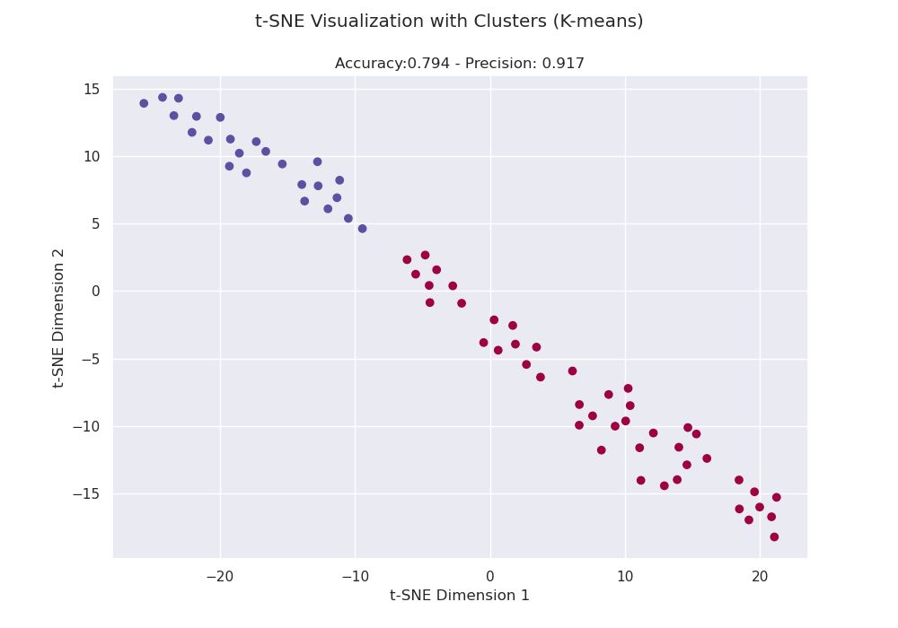

# Clustering of urls

There are 68 urls in the dataset from greek websites. The first half urls are product urls (i.e., a product from the
site and its details) and the last half urls are non-product urls from these sites (e.g., shipping information page,
contact page)

The urls are transformed to 100-dimensional character-level embeddings (i.e., letters, numbers and special characters
included in the urls). We then run k-means algorithm to group these urls to the 2 categories (product vs non-product).
Lastly, we reassign the labels generated from the clustering algorithm with the hungarian algorithm to get the best
mapping and produce accurate metrics for accuracy and precision.

## Requirements

Install the requirements included in the requirements.txt

## How-to run:

To run the algorithm, simply run the main.py file

## Results:

